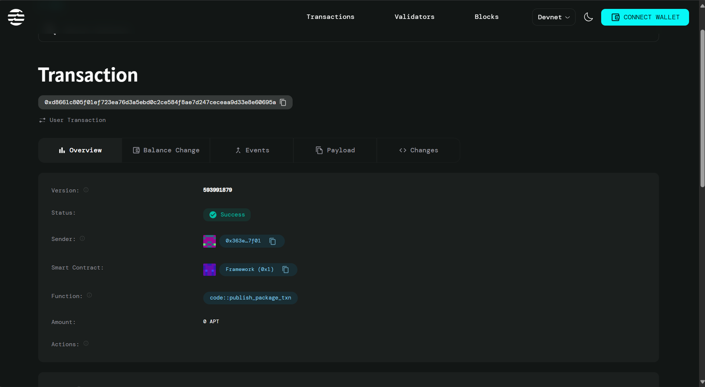

# KYC-less Enrollment via Wallet Ownership(Full Stack Application)


A decentralized application (DApp) built on Aptos blockchain that enables KYC-less user enrollment using only wallet ownership verification. No personal information required - just connect your wallet and enroll!


## 🌟 Features

- **Wallet-Based Enrollment**: Users enroll using only their Aptos wallet address
- **Privacy-First**: No personal information or KYC documentation required
- **On-Chain Verification**: All enrollment data stored securely on Aptos blockchain
- **Real-Time Status**: Check enrollment status instantly
- **Simple UI**: Clean, modern interface built with React and Tailwind CSS
- **Petra Wallet Integration**: Seamless connection with Petra wallet

## 🏗️ Architecture

### Smart Contract (`Move`)
- **Module**: `MyModule::KYClessEnrollment`
- **Functions**:
  - `enroll_user()`: Registers user's wallet address on-chain
  - `is_user_enrolled()`: Checks if a wallet is enrolled

### Frontend (`React + Vite`)
- Modern React application with Vite build tool
- Tailwind CSS for styling
- Petra Wallet SDK for blockchain interaction
- Lucide React for icons

## 📋 Prerequisites

Before you begin, ensure you have the following installed:

- **Node.js** (v18.x or higher) - [Download](https://nodejs.org/)
- **npm** (comes with Node.js)
- **Aptos CLI** - [Installation Guide](https://aptos.dev/tools/aptos-cli/install-cli/)
- **Petra Wallet** - [Chrome Extension](https://petra.app/)
- **Git** - [Download](https://git-scm.com/)

## 🚀 Quick Start

### 1. Clone the Repository

```bash
git clone https://github.com/yourusername/kyc-enrollment-dapp.git
cd kyc-enrollment-dapp
```

### 2. Setup Smart Contract

#### Initialize Aptos Account

```bash
cd move-contract
aptos init
```

Select `testnet` when prompted and save your account address.

#### Get Testnet Tokens

```bash
aptos account fund-with-faucet --account YOUR_ADDRESS
```

#### Compile the Contract

```bash
aptos move compile
```

#### Deploy to Testnet

```bash
aptos move publish
```

**Important**: Save the module address shown after deployment!

### 3. Setup Frontend

```bash
cd ../frontend
npm install
```

#### Configure Module Address

Open `src/App.jsx` and update:

```javascript
const MODULE_ADDRESS = "0xYOUR_DEPLOYED_ADDRESS_HERE";
```

Replace with your actual deployed contract address from step 2.

#### Run Development Server

```bash
npm run dev
```

Open [http://localhost:5173](http://localhost:5173) in your browser.

## 📱 How to Use

### For Users

1. **Install Petra Wallet**
   - Add Petra extension to your browser
   - Create a new wallet or import existing one
   - Switch to **Testnet** network

2. **Connect Wallet**
   - Open the DApp
   - Click "Connect Petra Wallet"
   - Approve connection in Petra popup

3. **Enroll**
   - Click "Enroll Now"
   - Approve transaction in Petra
   - Wait for confirmation (~5 seconds)
   - Success! You're enrolled ✓

4. **Check Status**
   - Your enrollment status appears automatically
   - Green badge indicates successful enrollment

## 📁 Project Structure

```
kyc-enrollment-dapp/
├── move-contract/
│   ├── sources/
│   │   └── KYClessEnrollment.move    # Smart contract
│   ├── Move.toml                      # Move configuration
│   └── .aptos/
│       └── config.yaml                # Aptos CLI config
├── frontend/
│   ├── src/
│   │   ├── App.jsx                    # Main React component
│   │   ├── App.css                    # Component styles
│   │   └── index.css                  # Global styles
│   ├── public/                        # Static assets
│   ├── package.json                   # Dependencies
│   ├── vite.config.js                 # Vite configuration
│   ├── tailwind.config.js             # Tailwind configuration
│   └── postcss.config.js              # PostCSS configuration
└── README.md
```

## 🔧 Development

### Run Tests (Smart Contract)

```bash
cd move-contract
aptos move test
```

### Build for Production

```bash
cd frontend
npm run build
```

The production build will be in `frontend/dist/`.

### Preview Production Build

```bash
npm run preview
```

## 🌐 Deployment

### Deploy Smart Contract to Mainnet

1. Switch Aptos CLI to mainnet:
```bash
aptos init --network mainnet
```

2. Get mainnet APT tokens
3. Deploy:
```bash
aptos move publish --network mainnet
```

### Deploy Frontend

Deploy to your preferred hosting service:

- **Vercel**: `npm run build` then deploy `dist/` folder
- **Netlify**: Connect GitHub repo, build command: `npm run build`, publish directory: `dist`
- **GitHub Pages**: Use `gh-pages` package

## 🛠️ Technologies Used

- **Blockchain**: Aptos
- **Smart Contract Language**: Move
- **Frontend Framework**: React 18
- **Build Tool**: Vite
- **Styling**: Tailwind CSS
- **Wallet**: Petra Wallet SDK
- **Icons**: Lucide React

## 📊 Smart Contract Details

### UserProfile Struct

```move
struct UserProfile has store, key {
    wallet_address: address,
    enrollment_time: u64,
    is_active: bool,
}
```

### Error Codes

- `E_ALREADY_ENROLLED (1)`: User is already enrolled
- `E_NOT_ENROLLED (2)`: User is not enrolled

## 🤝 Contributing

Contributions are welcome! Please follow these steps:

1. Fork the repository
2. Create a feature branch (`git checkout -b feature/AmazingFeature`)
3. Commit your changes (`git commit -m 'Add some AmazingFeature'`)
4. Push to the branch (`git push origin feature/AmazingFeature`)
5. Open a Pull Request

## 🐛 Troubleshooting

### Issue: "Petra Wallet not detected"
**Solution**: Install Petra extension and refresh the page

### Issue: "Transaction failed"
**Solution**: 
- Ensure you have testnet tokens
- Run: `aptos account fund-with-faucet --account YOUR_ADDRESS`
- Check Petra is on Testnet network

### Issue: "Module not found"
**Solution**: Verify MODULE_ADDRESS in `App.jsx` matches your deployed address

### Issue: Tailwind styles not working
**Solution**:
```bash
npm install -D tailwindcss postcss autoprefixer
npx tailwindcss init -p
```


## 🙏 Acknowledgments

- Aptos Labs for the blockchain platform
- Petra Wallet team for wallet integration
- React and Vite communities


## 🔗 Links

- [Aptos Documentation](https://aptos.dev/)
- [Petra Wallet](https://petra.app/)
- [Move Language](https://move-language.github.io/move/)
- [Live Demo](https://your-demo-link.com)

---

**Made with ❤️ on Aptos Blockchain**
##contact details

0xfc7a3cfa307008f9a349d62a1c079b33a52f4b093ef0cf4b1a423db2835871fb


